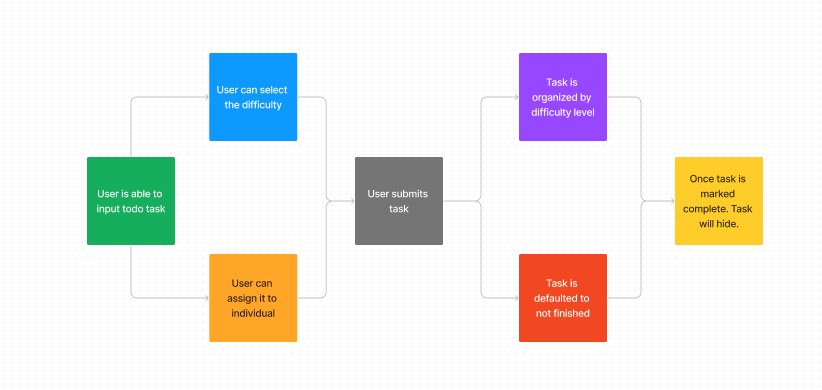

# LAB - 34

To Do List Manager Phase 4: Integrating with a live API.

Author: Jonathan Brooks

[Pull Request](https://github.com/jonbrooks01/todo-app/pull/1)

[Server Repo](https://github.com/jonbrooks01/todoServer-)

[deployed server](https://todoapp-0suw.onrender.com)

## Setup

.env requirements: NA

PORT - 5173

## Running the app

 npm run dev

<!-- Endpoint: Returns Object -->

<!-- {
  "domain": "deployment-practice-main.onrender.com/",
  "status": "{name: name}",
 "port":
} -->
Tests
Unit Tests: npm run test
<!-- Lint Tests: npm run lint -->

## UML

